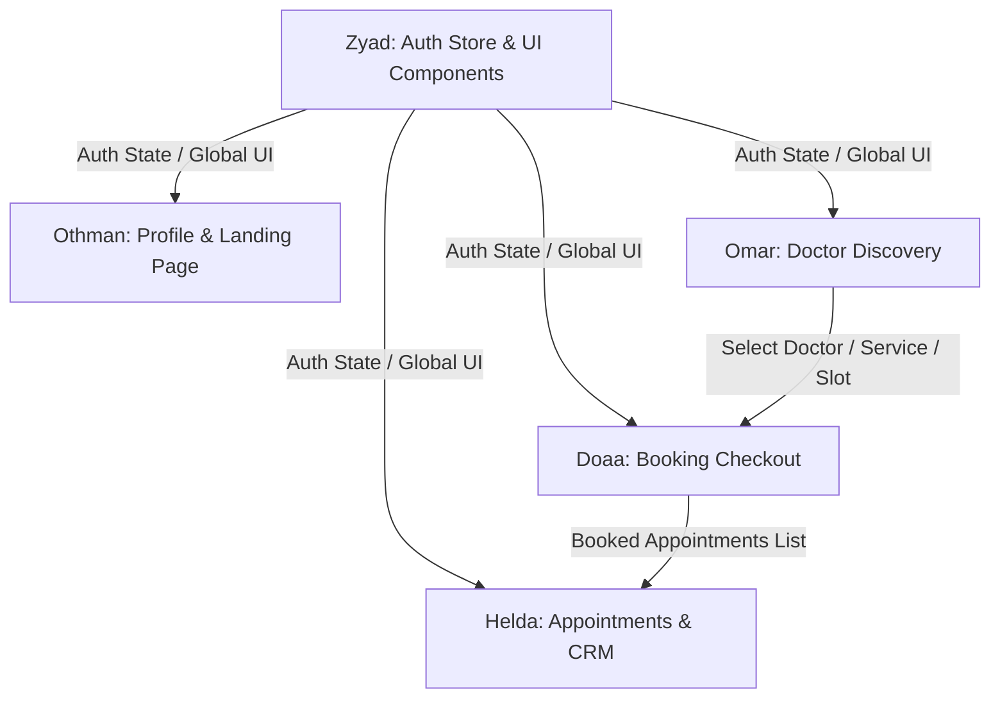

# Clarity Clinic — Patient Website React Developer Guide

Welcome to the React developer guide for the Clarity Clinic Patient Website. This document covers our framework architecture, global styling, translation systems, code validation tools, and details the exact task assignments for each developer.

---

## 1. Technical Architecture

The Patient Website is a single-page application built on **React 19**, **Vite**, **TypeScript**, and **Tailwind CSS v4**.

* **State Management**: **Zustand** (`src/store/authStore.ts`) handles authentication status, JWT storage, and current user profile details.
* **Server State**: **React Query** (`@tanstack/react-query`) handles all data querying, caching, loading/error flags, and automatic cache invalidation.
* **API Client**: **Axios** wrapper (`src/services/api/apiClient.ts`) handles base URLs, requests, and attaches JWT header tokens.
* **Form Validation**: **React Hook Form** + **Zod** schema validations.

---

## 2. Global Services & Utilities

### A. Toast Notifications
We wrap toast alerts inside [toast.ts](file:///e:/Courses/Next%20Academy/Graduation%20Project/patient-website/src/lib/toast.ts) using `react-hot-toast`. Import the wrapper object:
```tsx
import { showToast } from '../lib/toast';

// Success message (4s duration)
showToast.success('Profile updated successfully!');

// Error message (5s duration)
showToast.error('Double booking conflict detected!');

// Loading indicator
const toastId = showToast.loading('Booking slot...');
```

### B. Internationalization (i18n)
We use `react-i18next` for dual language support (English & Arabic) with dynamic directionality:
* **Translation Files**: Add key-value pairs inside `public/locales/en/translation.json` and `ar/translation.json`.
* **Component Usage**:
  ```tsx
  import { useTranslation } from 'react-i18next';

  export function SampleComponent() {
    const { t } = useTranslation();
    return <h2>{t('hero.title', 'Care, Booked Simply')}</h2>;
  }
  ```
* **RTL Layout**: The system sets `<html lang="ar" dir="rtl">` on language switches. Always use logical styling properties (e.g. `ms-4`, `pe-6`, `text-start`) instead of absolute ones (`ml-4`, `pr-6`, `text-left`) so the browser aligns grids and layouts automatically.

### C. Theme Configuration (Dark / Light)
Styling utilizes centralized CSS variables mapped to Tailwind variables inside [index.css](file:///e:/Courses/Next%20Academy/Graduation%20Project/patient-website/src/index.css). 
* **Rule**: Never use Tailwind's `dark:` utility classes. Instead, use semantic variables:
  ```html
  <!-- ✅ CORRECT -->
  <div class="bg-surface text-text border-border">Content</div>

  <!-- ❌ INCORRECT -->
  <div class="bg-white dark:bg-slate-900 text-black dark:text-white">Content</div>
  ```

---

## 3. Shared Components Matrix

Shared UI, layout, and feedback components are structured inside `src/components/`. Zyad maintains these modules. Do not edit them directly without coordination.

| Component Name | File Path | Prop / Type Specifications | Consuming Developers |
|:---|:---|:---|:---|
| **Button** | [Button.tsx](file:///e:/Courses/Next%20Academy/Graduation%20Project/patient-website/src/components/ui/Button.tsx) | `variant?: 'primary'\|'secondary'\|'ghost'`, React standard attributes | Zyad, Othman, Omar, Doaa, Helda |
| **Input** | [Input.tsx](file:///e:/Courses/Next%20Academy/Graduation%20Project/patient-website/src/components/ui/Input.tsx) | `label?: string`, `error?: string`, React standard input props | Zyad, Othman, Doaa |
| **Select** | [Select.tsx](file:///e:/Courses/Next%20Academy/Graduation%20Project/patient-website/src/components/ui/Select.tsx) | `label?: string`, `options: {value, label}[]`, `error?: string` | Omar, Doaa |
| **Textarea** | [Textarea.tsx](file:///e:/Courses/Next%20Academy/Graduation%20Project/patient-website/src/components/ui/Textarea.tsx) | `label?: string`, `error?: string`, React standard textarea props | Othman, Doaa |
| **Badge** | [Badge.tsx](file:///e:/Courses/Next%20Academy/Graduation%20Project/patient-website/src/components/ui/Badge.tsx) | React standard attributes | Omar, Helda |
| **Modal** | [Modal.tsx](file:///e:/Courses/Next%20Academy/Graduation%20Project/patient-website/src/components/ui/Modal.tsx) | `isOpen: boolean`, `onClose: () => void`, `title?: string`, `children` | Doaa |
| **Spinner** | [Spinner.tsx](file:///e:/Courses/Next%20Academy/Graduation%20Project/patient-website/src/components/ui/Spinner.tsx) | SVG props | Omar, Doaa, Helda |
| **ThemeToggle**| [ThemeToggle.tsx](file:///e:/Courses/Next%20Academy/Graduation%20Project/patient-website/src/components/ui/ThemeToggle.tsx) | Header toggle action button | Zyad, Othman |
| **LanguageToggle**|[LanguageToggle.tsx](file:///e:/Courses/Next%20Academy/Graduation%20Project/patient-website/src/components/ui/LanguageToggle.tsx) | Language switcher button | Zyad, Othman |
| **Navbar** | [Navbar.tsx](file:///e:/Courses/Next%20Academy/Graduation%20Project/patient-website/src/components/layout/Navbar.tsx) | Sticky layout header navigation | Zyad, Othman |
| **Footer** | [Footer.tsx](file:///e:/Courses/Next%20Academy/Graduation%20Project/patient-website/src/components/layout/Footer.tsx) | Bottom copy-right layout block | Zyad, Othman |
| **PageContainer**|[PageContainer.tsx](file:///e:/Courses/Next%20Academy/Graduation%20Project/patient-website/src/components/layout/PageContainer.tsx)| Container padding wrapper | Zyad, Othman |
| **EmptyState** | [EmptyState.tsx](file:///e:/Courses/Next%20Academy/Graduation%20Project/patient-website/src/components/feedback/EmptyState.tsx)| `icon`, `title`, `description`, `action` | Omar, Helda |
| **ErrorState** | [ErrorState.tsx](file:///e:/Courses/Next%20Academy/Graduation%20Project/patient-website/src/components/feedback/ErrorState.tsx)| `message?`, `onRetry?` | Omar, Helda |
| **LoadingState**|[LoadingState.tsx](file:///e:/Courses/Next%20Academy/Graduation%20Project/patient-website/src/components/feedback/LoadingState.tsx)| `message?` | Omar, Helda |

---

## 4. Deep Developer Tasks Reference

### Zyad — Authentication & Session Stores
* **Goal**: Establish core authentication and session state so other pages can retrieve active logins.
* **Files to Edit / Build**:
  * Implement auth login/logout state inside [authStore.ts](file:///e:/Courses/Next%20Academy/Graduation%20Project/patient-website/src/store/authStore.ts).
  * Build `Login.tsx` page and `Register.tsx` page inside `src/pages/auth/`.
* **API Endpoints**:
  * `POST /api/auth/register`: Signup patient profile details.
  * `POST /api/auth/login`: Authenticate and fetch JWT token.
  * `GET /api/auth/me`: Resolve current active session user parameters.
* **Component Usage**: Use `Button` (for triggers), `Input` (for email, password, displayName), and trigger `showToast.success` or `showToast.error` during session setup.

### Othman — First Impressions & Profiles
* **Goal**: Create a premium Landing Home page and complete patient profile editing.
* **Files to Edit / Build**:
  * Build `Home.tsx` page inside `src/pages/`.
  * Build `Profile.tsx` page inside `src/pages/profile/`.
* **API Endpoints**:
  * `PUT /api/auth/profile`: Update patient personal profile attributes.
* **Component Usage**:
  * **Landing Home**: Use `HeroSection`, `SectionHeader`, `FeatureCard`, and `TestimonialCard`. Use a rich layout matching Figma templates.
  * **Profile Page**: Use `ProfileCard` (to display avatar, email, name), `Input`, `Textarea` (for bios), and `Button` (to save details). Provide validations using React Hook Form.

### Omar — Doctor Discovery Flow
* **Goal**: Enable patients to browse active doctor lists, filter details, and check slot schedules.
* **Files to Edit / Build**:
  * Build `DoctorsList.tsx` page inside `src/pages/doctors/`.
  * Build `DoctorDetail.tsx` page inside `src/pages/doctors/`.
* **API Endpoints**:
  * `GET /api/doctors`: Fetch list of active doctors with filters.
  * `GET /api/doctors/{id}`: Fetch doctor details and services metadata.
  * `GET /api/doctors/{id}/slots`: Query available dates/time-slots (send parameters: `date` and `serviceId`).
* **Component Usage**:
  * **DoctorsList**: Map list to multiple `DoctorCard` items. Use `SearchInput` to filter text keys.
  * **DoctorDetail**: Use `SectionHeader` for specialties, `ServiceCard` to list services, and `Spinner`/`LoadingState`/`EmptyState` when loading availability dates.

### Doaa — Booking Checkout Engine
* **Goal**: Implement the appointment scheduling flow, including mock payment checkout screens.
* **Files to Edit / Build**:
  * Build `Booking.tsx` page inside `src/pages/booking/`.
* **API Endpoints**:
  * `POST /api/appointments`: Book an appointment (passes `doctorId`, `serviceId`, `date`, `timeSlot`).
  * `POST /api/payments/mock/pay`: Submit mock payment checkout details.
* **Component Usage**: Use `BookingSummaryCard` to display selected options, `Select` (to pick payment mode: cash or online), `Input` for card billing placeholders, `Modal` for confirmation, and trigger success/error toasts.

### Helda — Patient CRM Dashboard & Cancellations
* **Goal**: Provide patients access to their scheduled visits, active prescriptions, and cancellation triggers.
* **Files to Edit / Build**:
  * Build `MyAppointments.tsx` page inside `src/pages/appointments/`.
  * Build `MyPrescriptions.tsx` page inside `src/pages/prescriptions/`.
* **API Endpoints**:
  * `GET /api/me/appointments`: Get list of active/past appointments.
  * `GET /api/me/prescriptions`: Get patient's issued prescriptions.
  * `PUT /api/appointments/{id}/cancel`: Cancel booking.
* **Component Usage**: Map appointments to `AppointmentCard` components. Use `Badge` for status display (e.g. Confirmed, Completed, Cancelled). Use `LoadingState` and `EmptyState` for empty record listings.

---

## 5. Dependencies & Parallel Work Strategy

To avoid bottlenecks and enable all 5 developers to work in parallel on the patient website, we use a **Contract-First & Mock-First** strategy.

### A. Team Dependency Mapping



* **Zyad** (Core Platform): Build auth store and shared component stubs first. All other developers depend on these utilities.
* **Omar** (Doctor Discovery): Must establish and share the doctor/service/slot metadata structure because **Doaa** needs it.
* **Doaa** (Booking Checkout): Depends on Omar's discovery data. Once booking completes, **Helda** reads the resulting appointments.
* **Helda** (Appointments & CRM): Depends on Doaa's checkout actions to see and cancel appointments.

---

### B. Parallel Playbook: What to Do

To ensure no developer is blocked waiting on another, implement the following techniques:

#### 1. Mocking the Auth Store (Zustand)
If Zyad is still setting up the auth slice or backend endpoints, do not wait. Edit your local files to bypass authentication, or populate the store state with a dummy patient.
* **How-to**: In [authStore.ts](file:///e:/Courses/Next%20Academy/Graduation%20Project/patient-website/src/store/authStore.ts), you can configure a default value:
  ```typescript
  // Temporary developer bypass in authStore.ts
  export const useAuthStore = create<AuthState>((set) => ({
    user: {
      id: 'dev-patient-123',
      displayName: 'Test Patient (Dev Mode)',
      email: 'testpatient@example.com',
      role: 'patient',
    },
    isAuthenticated: true,
    token: 'mock-jwt-token-xyz',
    setAuth: (user, token) => set({ user, token, isAuthenticated: !!user }),
    logout: () => set({ user: null, token: null, isAuthenticated: false }),
  }));
  ```
* This immediately logs you in automatically and provides user data to your profile (Othman), checkout (Doaa), and appointments (Helda) views.

#### 2. Contract-Based Route State Passing
Doaa’s Checkout screen depends on Omar’s Doctor details. Omar and Doaa agree on a routing contract.
* **Contract**: Omar navigates to `/booking` using `react-router-dom` and passes the data in location state:
  ```typescript
  // Omar's navigation trigger in DoctorDetail.tsx
  navigate('/booking', {
    state: {
      doctorId: 'doc-456',
      doctorName: 'Dr. Jane Smith',
      serviceId: 'srv-789',
      serviceName: 'General Consultation',
      date: '2026-06-25',
      timeSlot: '10:00 AM',
    }
  });
  ```
* **Consumption**: Doaa retrieves it safely with fallback protection:
  ```typescript
  // Doaa's retrieval in Booking.tsx
  import { useLocation } from 'react-router-dom';

  interface BookingRouteState {
    doctorId: string;
    doctorName: string;
    serviceId: string;
    serviceName: string;
    date: string;
    timeSlot: string;
  }

  const location = useLocation();
  const bookingDetails = (location.state as BookingRouteState) || {
    doctorId: 'mock-doc-123',
    doctorName: 'Mock Doctor (Dev Fallback)',
    serviceId: 'mock-srv-123',
    serviceName: 'Mock Service',
    date: '2026-06-20',
    timeSlot: '09:00 AM',
  };
  ```
* *Result*: Both developers work in isolation. Omar builds lists; Doaa designs forms with complete datasets.

#### 3. Resolving React Query Mock Data
If REST endpoints (`GET /api/doctors`, `GET /api/me/appointments`) are not ready:
* **How-to**: Return mock arrays inside the query functions or use the React Query `initialData` parameter.
  ```typescript
  // Helda's MyAppointments.tsx
  const MOCK_APPOINTMENTS = [
    { id: '1', doctorName: 'Dr. Jane Smith', date: '2026-06-25', time: '10:00 AM', status: 'Confirmed' },
    { id: '2', doctorName: 'Dr. John Doe', date: '2026-06-15', time: '02:00 PM', status: 'Completed' }
  ];

  const { data: appointments, isLoading } = useQuery({
    queryKey: ['appointments'],
    queryFn: async () => {
      // Uncomment when API is live:
      // const response = await apiClient.get('/api/me/appointments');
      // return response.data;
      
      // Temporary Dev Mock:
      return new Promise<typeof MOCK_APPOINTMENTS>((resolve) => 
        setTimeout(() => resolve(MOCK_APPOINTMENTS), 800)
      );
    }
  });
  ```
* *Result*: Helda builds lists, status badges, and cancellation triggers without a single backend API call.

---

## 6. Quality Enforcement & Commit Guide

We enforce Husky pre-commit hooks. Before staging files:
1. Conventional Commits structure is mandatory: `type(scope): message` (e.g. `feat(ui): add booking checkout layout`).
2. Code formatting is checked by **Prettier** and **ESLint** automatically during `git commit`. Errors block commits.
